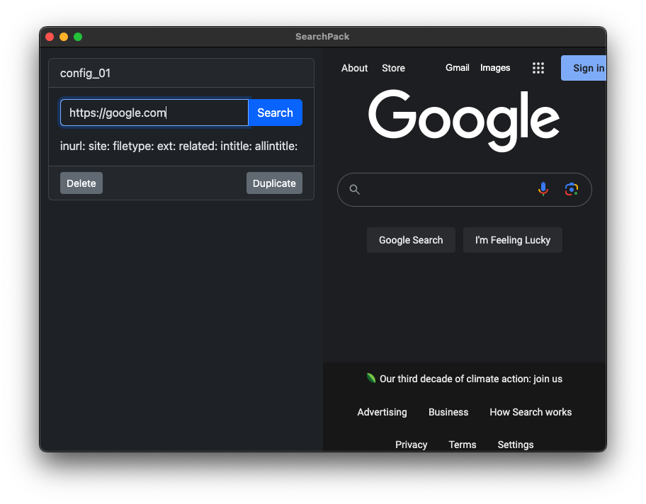

## Search Pack

Many websites provide search bars, which go unused by browsers.  
Search Pack provides the following features to make searches more powerful:

1. Configure search operators
2. Save the configuration
3. Search against those saved configurations

